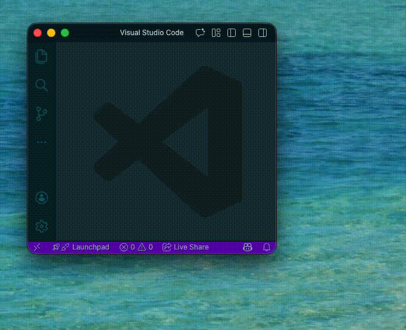

# HeaveWindow

A lightweight macOS window manager that lets you move and resize windows using keyboard.



## Features

- Move and resize windows without using a mouse
- Customizable hotkey configuration

## Usage

### Basic Operation

1. Press `Option + Shift + Space` to enter move mode (the active window will be highlighted)
2. Use the following keys to move the window:
   - `h` or `←` : Move left
   - `j` or `↓` : Move down
   - `k` or `↑` : Move up
   - `l` or `→` : Move right
3. Hold `Shift` while pressing movement keys to resize instead of move
4. Press `Escape` or `Enter` to exit move mode

### Custom Hotkey Configuration

Create a configuration file at `~/.config/heave-window/config.yml`:

```yaml
hotkey:
  modifiers:
    - command
    - shift
  key: space
```

#### Supported Modifiers

- `option` or `alt`
- `command` or `cmd`
- `control` or `ctrl`
- `shift`

#### Supported Keys

- `space`
- `a-z`
- `0-9`
- `f1-f12`
- `escape`, `return`, `tab`, `delete`
- Arrow keys: `up`, `down`, `left`, `right`

## Requirements

- macOS 11.5 or later
- Accessibility permissions (System Settings > Privacy & Security > Accessibility)

